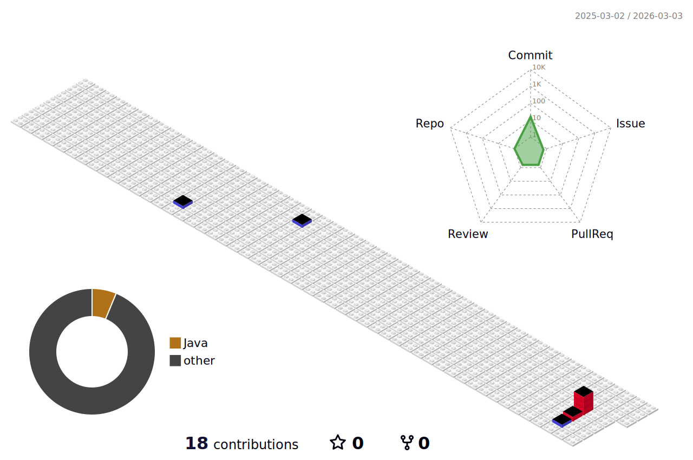

  

  <!--div align="right">
    
  </div-->
   

  
  

 

  <h3 style="border-bottom: 2px solid #333; color: #333; padding-bottom: 5px;"> 🎨 Frontend </h3>
  

    
    
    
    
  

  <h3 style="border-bottom: 2px solid #333; color: #333; padding-bottom: 5px;"> ☕ Backend </h3>
  

    
    
     
    
    
    
    
     
    
    
  

  <h3 style="border-bottom: 2px solid #333; color: #333; padding-bottom: 5px;"> 🗄️ Database & Cache </h3>
  

    
    
  

  <h3 style="border-bottom: 2px solid #333; color: #333; padding-bottom: 5px;"> 🛠️ Tools & DevOps </h3>
  

    
    
    
    
    
     
    
    
    
    
     
    
    
    
  

<h3 style="border-bottom: 2px solid #333; color: #333; padding-bottom: 5px;"> 🧑‍💻 Contact me </h3>

  
  
  

